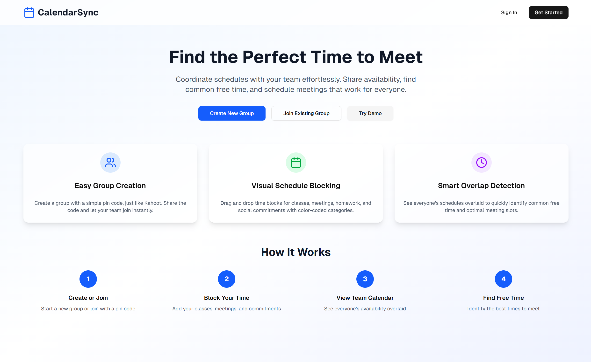
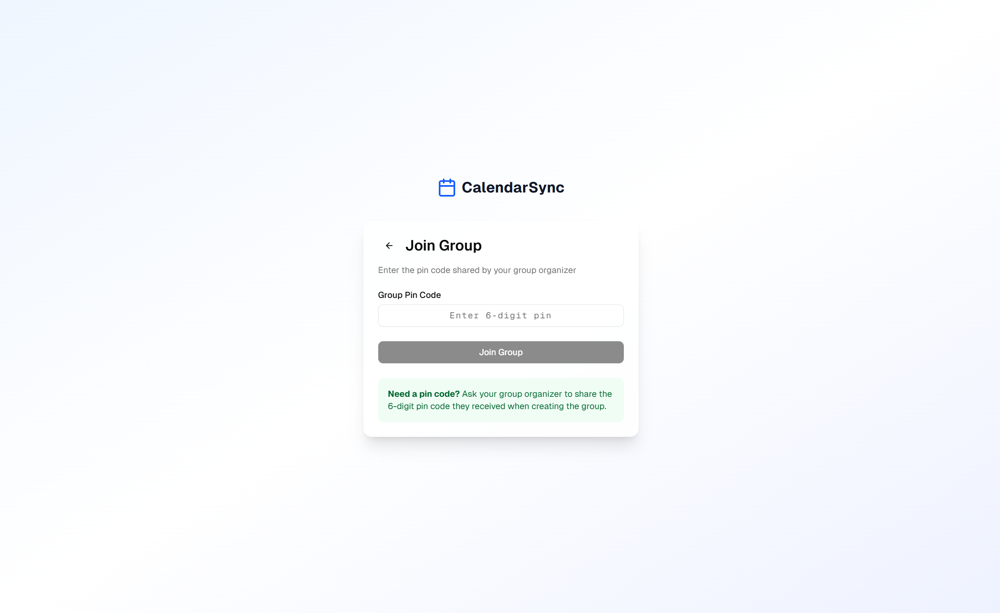
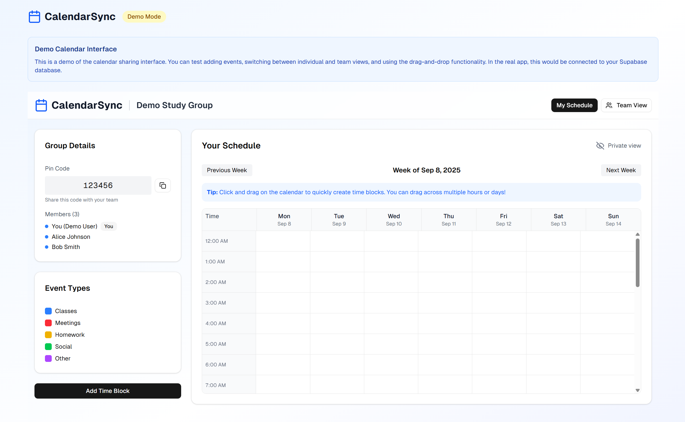
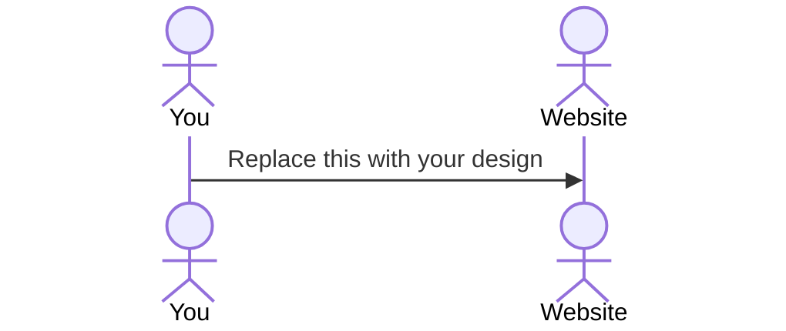

# Whenworks
[My Notes](notes.md)

Enough haggling back and forth, this application helps you find out when works for you and your team! Meetings, hangouts or simply finding free time in your schedules, use Whenworks now!

> [!NOTE]
>  This is a template for your startup application. You must modify this `README.md` file for each phase of your development. You only need to fill in the section for each deliverable when that deliverable is submitted in Canvas. Without completing the section for a deliverable, the TA will not know what to look for when grading your submission. Feel free to add additional information to each deliverable description, but make sure you at least have the list of rubric items and a description of what you did for each item.

> [!NOTE]
>  If you are not familiar with Markdown then you should review the [documentation](https://docs.github.com/en/get-started/writing-on-github/getting-started-with-writing-and-formatting-on-github/basic-writing-and-formatting-syntax) before continuing.

## 🚀 Specification Deliverable

> [!NOTE]
>  Fill in this sections as the submission artifact for this deliverable. You can refer to this [example](https://github.com/webprogramming260/startup-example/blob/main/README.md) for inspiration.

For this deliverable I did the following. I checked the box `[x]` and added a description for things I completed.

- [x] Proper use of Markdown
- [x] A concise and compelling elevator pitch
- [x] Description of key features
- [x] Description of how you will use each technology
- [x] One or more rough sketches of your application. Images must be embedded in this file using Markdown image references.

### Elevator pitch

Finding time with a team shouldn’t feel like solving a puzzle. Our collaborative scheduling web app makes it simple: each member quickly drags and drops their time blocks (classes, meetings, social events, etc.) onto a personal calendar, then the app merges everyone’s schedules into one group view. The shared calendar highlights free time slots and least-busy options, so groups can effortlessly find the best time to meet without endless text threads or doodle polls. Make frustrating availability coordination a thing of the past!

### Design

The homepage describes the purpose of the website and teaches users how to use it!

The create page allows users to create a group calendar...

While the join page allows users to join existing calendars.

The calendar page offers a quick and easy way for individuals to drag and drop color coded activities onto an individual calendar, which will be compiled for their collective viewing and decision making on the group calendar.

### Key features

- Secure login with group code (like Kahoot PIN) and user credentials
- Drag-and-drop calendar interface to add personal commitments
- Color-coded time blocks (Classes, Homework, Meetings, Social, etc.)
- Real-time group calendar view showing overlapping commitments
- Automatic highlight of free/common time slots
- Ability to edit and resubmit individual schedules
- Persistent storage of schedules in the database
- Aesthetic and responsive calendar display for desktop and mobile
- Admin functionality to create/delete groups

### Technologies

I am going to use the required technologies in the following ways.

- **HTML** - Three main pages: Login page (with group code entry) and Calendar page (drag-and-drop interface) for individual and team. Two additional Create and Join Pages.
- **CSS** - Application styling that looks good on different screen sizes, uses good whitespace, color choice and contrast.
- **React** - Login form, Calendar interface, Group calendar display. React Router for navigation.
- **Service** - Backend service with endpoints for
  * Login
  * Schedule - Submit user's calendar blocks
  * Schedule - Retrieving team's calendar blocks
- **DB/Login** - Store users, individual calendars, and team calendars in database. Register and login users. Credentials securely stored in database. Can't schedule unless authenticated.
- **WebSocket** - As each user submits their schedules, their time blocks are broadcast to all other users to view.

## 🚀 AWS deliverable

For this deliverable I did the following. I checked the box `[x]` and added a description for things I completed.

- [X] **Server deployed and accessible with custom domain name** - [My server link](https://kyleledesma.com).

## 🚀 HTML deliverable

For this deliverable I did the following. I checked the box `[x]` and added a description for things I completed.

- [x] **HTML pages** - index.html (homepage), createpage.html, joinpage.html, calendar.html
- [x] **Proper HTML element usage** - HTML elements such as nav, section, div, button and li were all used in the project.
- [x] **Links** - index.html is linked to all the pages, createpage.html and joinpage.html are both linked to index.html and calendar.html.
- [x] **Text** - Text is present, describing the application's purpose, function and instructions.
- [x] **3rd party API placeholder** - API placeholder for quote generation.
- [x] **Images** - API placeholder for quote to include random image of the days.
- [x] **Login placeholder** - Create and join group acts as log in. No intended to have a log in let for ease of use.
- [x] **DB data placeholder** - Calendar within calendar page will display database data on users' schedules.
- [x] **WebSocket placeholder** - Immediate update of the team calendar when individual team member updates their schedule.

## 🚀 CSS deliverable

For this deliverable I did the following. I checked the box `[x]` and added a description for things I completed.

- [x] **Header, footer, and main content body** - I completed this part of the deliverable in the last push with HTML deliverable
- [x] **Navigation elements** - I completed this part of the deliverable in the last push with HTML deliverable
- [x] **Responsive to window resizing** - I completed this part of the deliverable in the last push with HTML deliverable
- [x] **Application elements** - I completed this part of the deliverable in the last push with HTML deliverable
- [x] **Application text content** - I completed this part of the deliverable in the last push with HTML deliverable
- [x] **Application images** - I completed this part of the deliverable in the last push with HTML deliverable

## 🚀 React part 1: Routing deliverable

For this deliverable I did the following. I checked the box `[x]` and added a description for things I completed.

- [X] **Bundled using Vite** - I bunlded the project using vite
- [X] **Components** - I created all the app and view components and converted my html code to the react components required for my startup application
- [X] **Router** - I implemented the router to navigate to my login, join, create and calendar pages

## 🚀 React part 2: Reactivity deliverable

For this deliverable I did the following. I checked the box `[x]` and added a description for things I completed.

- [X] **All functionality implemented or mocked out** - I adequately completed this requirement according to Professor Clement. Everything from signing up, joining and creating groups, and storing calendar info.
- [X] **Hooks** - I did implement this part of the deliverable. See src/hooks. Used for drag and dropping events on the calendar and calendar navigation.

## 🚀 Service deliverable

For this deliverable I did the following. I checked the box `[x]` and added a description for things I completed.

- [X] **Node.js/Express HTTP service** - I drafted a schema for storing data and created arrays and endpoints to match the schema. Three seperate arrays to store user, team and event data. Created the appropriate helper functions to aide in moving the data to the correct storage array.
- [X] **Static middleware for frontend** - I implemented static middleware for the frontend by following the Simon Service instructions for "Serving the front-end static file".
- [X] **Calls to third party endpoints** - I added a quote of the day, third party endpoint call on my homepage.
- [X] **Backend service endpoints** - I completed this part of the deliverable in service/index.js by with the create, login, events and team routes.
- [X] **Frontend calls service endpoints** - I completed this part of the deliverable by updating the localStorage logic and insteading fetching for data from the service/index.jsx arrays. This effectively allows the data to persist in the server so long as the server is not shutdown.
- [X] **Supports registration, login, logout, and restricted endpoint** - I completed all these requirements.

## 🚀 DB deliverable

For this deliverable I did the following. I checked the box `[x]` and added a description for things I completed.

- [ ] **Stores data in MongoDB** - I did not complete this part of the deliverable.
- [ ] **Stores credentials in MongoDB** - I did not complete this part of the deliverable.

## 🚀 WebSocket deliverable

For this deliverable I did the following. I checked the box `[x]` and added a description for things I completed.

- [ ] **Backend listens for WebSocket connection** - I did not complete this part of the deliverable.
- [ ] **Frontend makes WebSocket connection** - I did not complete this part of the deliverable.
- [ ] **Data sent over WebSocket connection** - I did not complete this part of the deliverable.
- [ ] **WebSocket data displayed** - I did not complete this part of the deliverable.
- [ ] **Application is fully functional** - I did not complete this part of the deliverable.
